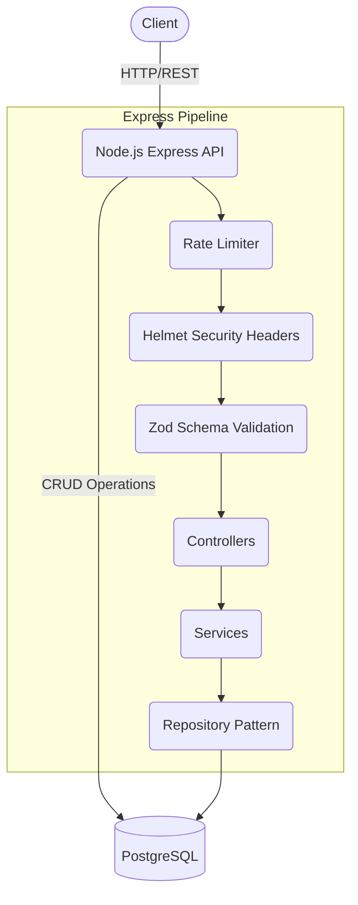

# Modular TypeScript Todo API

A hands-on DevOps project demonstrating core principles: CI/CD, Containerization, IaC, Observability, Reliability, and Security.

# Modular Todo API

A robust, production-ready Todo API built with Node.js, Express, TypeScript, and PostgreSQL. It incorporates modern DevOps practices, security best practices, and clean architecture.

## Architecture Overview



## Features

- **Robust Architecture:** Employs the Repository Pattern to abstract DB logic.
- **Security First:** Uses `helmet` for security headers and `express-rate-limit` against brute-force attacks.
- **Reliability:** Built-in global error handling and graceful shutdown processes.
- **Containerized:** Multi-stage optimized Docker builds.
- **Observability:** Prometheus metrics (`/metrics`) and comprehensive logging using `winston`.
- **API Documentation:** Interactive Swagger UI available at `/api-docs`.

## Tech Stack

- **Backend:** Node.js, Express.js, TypeScript
- **Database:** PostgreSQL (`pg`)
- **Validation:** Zod
- **Testing:** Jest, Supertest
- **DevOps:** Docker, Docker Compose, GitHub Actions CI/CD

## Getting Started

### Prerequisites

- [Docker](https://docs.docker.com/get-docker/) and Docker Compose installed.
- [Node.js](https://nodejs.org/en/) (if running locally without Docker).

### Running with Docker (Recommended)

1. Rename `.env.example` to `.env` (the defaults are ready to go).
2. Start the services:
   ```bash
   docker-compose up --build -d
   ```
3. The API will be available at `http://localhost:3000`.
4. Access the Swagger documentation at `http://localhost:3000/api-docs`.

### Running Locally

1. Ensure you have a PostgreSQL instance running.
2. Update the `.env` file with your database credentials.
3. Install dependencies:
   ```bash
   npm install
   ```
4. Run the development server:
   ```bash
   npm run dev
   ```

## API Endpoints

- `GET /health` - Healthcheck endpoint
- `GET /metrics` - Prometheus metrics
- `GET /api-docs` - Swagger UI Documentation
- `POST /todos` - Create a new todo
- `GET /todos` - Retrieve all todos
- `GET /todos/:id` - Retrieve a specific todo
- `PATCH /todos/:id` - Update a todo
- `DELETE /todos/:id` - Delete a todo
- `GET /todos/stats` - Retrieve todo completion statistics

## Testing

Run unit and integration tests using:

```bash
npm test
```

## License

ISC

## 📂 Project Structure

```
src/
├── common/         # Shared utilities (Logger, Middleware)
├── modules/        # Feature modules (Todo, Health)
├── infra/          # Infrastructure (Terraform AWS)
├── k8s/            # Kubernetes Manifests
├── app.ts          # Express App Setup
└── server.ts       # Server Entry Point
```

## 🔗 Endpoints

- `GET /health`: Check API status.
- `GET /metrics`: Prometheus metrics.
- `GET /todos`: List all todos.
- `POST /todos`: Create a todo (Body: `{ "title": "..." }`).
- `PATCH /todos/:id`: Update a todo.
- `DELETE /todos/:id`: Delete a todo.
